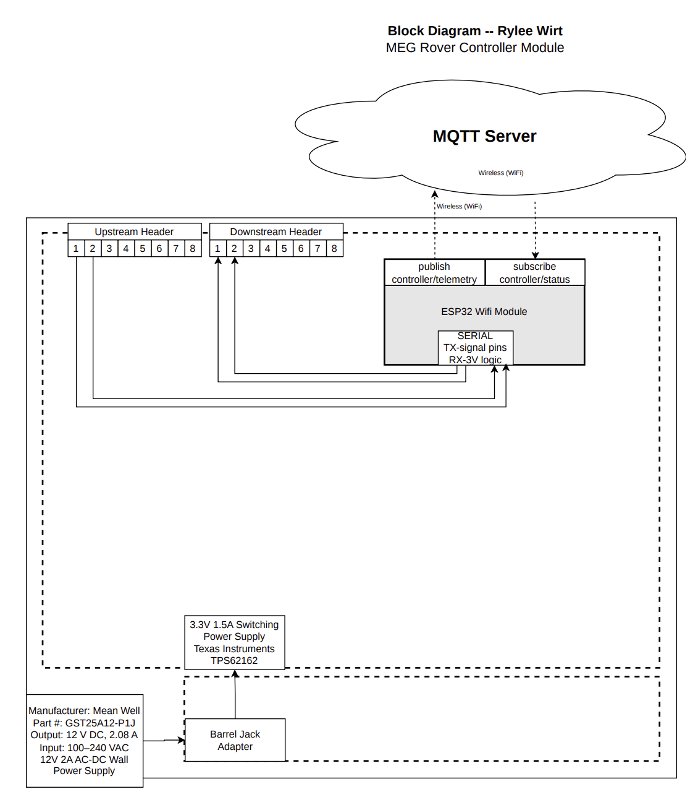

## Overview

This block diagram illustrates the high level electrical and communication architecture of my Controller Module for Team 301’s rover system. The purpose of this diagram is to clearly show what hardware is implemented on my board, how power is regulated and distributed, and how communication flows between this module and the rest of the rover system.

The controller module is built around an ESP32 WiFi enabled microcontroller operating at 3.3 V logic. The ESP32 serves as the primary control and communication device for this board. It connects wirelessly to an MQTT server and publishes telemetry data while subscribing to control or status topics. This enables structured, bidirectional communication within the distributed rover architecture.

Communication with neighboring team modules occurs through upstream and downstream ribbon cable headers. These headers carry low voltage digital signals and provide a structured path for data exchange between boards. A UART interface operating at 3.3 V logic is used for serial communication between the ESP32 and the external header connections.

Power is supplied by an external 12 V DC wall adapter connected through a barrel jack. This 12 V input is stepped down on board using a Texas Instruments TPS62162 switching regulator to generate a regulated 3.3 V rail. The regulated 3.3 V supply powers the ESP32 and all logic level circuitry on the controller board.

The dashed boundary in the diagram represents the physical controller PCB. Components inside this boundary are implemented on my board, while the MQTT server and external power adapter exist outside the module.

This block diagram provides a clear reference for how the controller module integrates into the full Team 301 rover system and serves as the foundation for the schematic and PCB design.

---

## Block Diagram

## Block Diagram Explanation

The block diagram was developed to represent the major functional components of the system and how they interact to meet the overall project requirements.

The central component of the system is the ESP32-S3 microcontroller, which handles both processing and wireless communication. It serves as the main control unit and interfaces with all other subsystems. This design choice simplifies the architecture by combining computation and communication into a single device.

The power subsystem is responsible for converting the input voltage from the battery into a stable 3.3 V supply used by all digital components. This ensures that all devices operate within their required voltage range and provides a consistent power source for reliable operation.

The temperature sensing subsystem connects directly to the microcontroller and provides environmental data. This data is processed by the ESP32 and can be transmitted wirelessly as part of the system’s functionality.

Communication between blocks was structured to minimize complexity while maintaining flexibility. All peripheral components connect directly to the microcontroller, reducing the need for intermediate components and simplifying debugging.

Overall, the block diagram reflects a design that prioritizes simplicity, integration, and reliability. Each block directly supports a system requirement, and the connections between blocks were chosen to ensure efficient data flow and ease of implementation.

### Downloadable Version

A high resolution PDF version of this block diagram is available here:

[EGR314 Block Diagram PDF](EGR314_Block_Diagram_WIRT.pdf)
