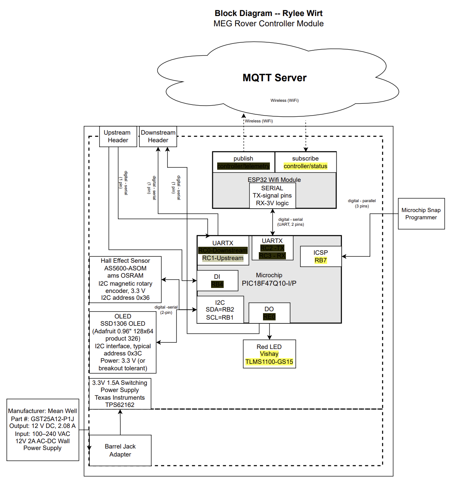

## Overview
This block diagram shows the high level electrical layout of my rover controller module and how it interfaces with the rest of the team system. 
The purpose of this diagram is to clearly document what components are on my board, how they are powered, and how data and control signals flow between subsystems and teammates.  

My controller module operates using two primary power levels. 
A 12 V DC supply is provided by an external wall power adapter and distributed to support drivetrain related power needs through a dedicated motor power connector. 
A regulated 3.3 V rail is generated on board using a switching regulator and is used to power all logic level components including the microcontroller, sensors, display, and communication hardware.  

The main microcontroller on this board is a PIC18F47Q10, which is responsible for sensor data processing, local control logic, and interfacing with neighboring team modules. 
An ESP32 module is used for wireless communication and handles WiFi connectivity and MQTT messaging to and from the rover control system.  

This module includes a magnetic rotary encoder used as a sensor for position or rotational feedback, which communicates over an I2C bus. 
A small OLED display is also connected over I2C and is used for local status and debugging information. 
A status LED provides a simple visual indication of system state.  

Actuation and motor driving are handled by the drivetrain team, so this board does not include a motor driver. 
Instead, it provides power distribution and communication interfaces to support the drivetrain subsystem without constraining their hardware choices.  

Team level connections are supported through upstream and downstream ribbon cable headers. 
These connectors carry power, ground, and low speed digital communication signals, allowing this module to exchange data with adjacent team boards in a structured and consistent way.  

Overall, this block diagram is intended to serve as a clear reference for how my controller module fits into the larger rover system. 
It will also be used as a guide when developing the detailed schematic and PCB layout later in the project. 

##  Block Diagram 

