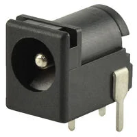
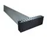
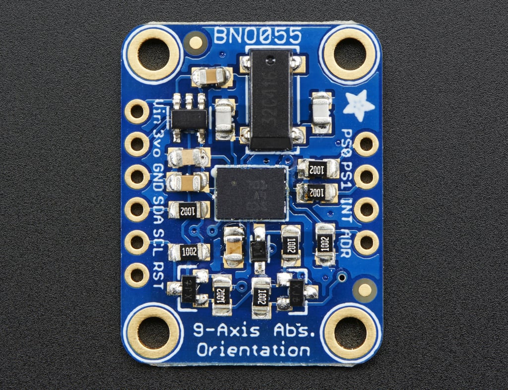
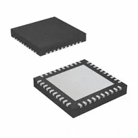
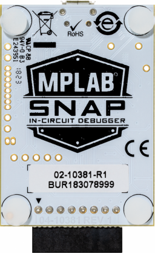

## Module's Selected Major Components

The controller module is responsible for receiving user input, executing control algorithms, communicating over the team daisy-chain UART network, and interfacing between the Sensor and Actuator subsystems. Wireless controller input and laptop-based HMI functionality are enabled through an ESP32 companion module.

---

### Power Management

1. **MP2307DN-LF-Z 3.3V Synchronous Buck Regulator**

* 3A synchronous buck switching regulator  
* Wide input voltage range (4.75V–23V)  
* DigiKey: https://www.digikey.com/en/products/detail/monolithic-power-systems-inc/MP2307DN-LF-Z/5292007  
* Datasheet: https://www.monolithicpower.com/en/documentview/productdocument/index/version/2/document_type/Datasheet/lang/EN/sku/MP2307/document_id/503/

| Pros | Cons |
| --- | --- |
| Provides sufficient current for PIC and ESP32 | Requires external inductor and proper PCB layout |
| Surface mount package | Slightly more complex than linear regulator |
| Meets switching regulator requirement | |

**Rationale:** The MP2307 provides a stable 3.3V supply rail for all digital components while meeting the course requirement for a switching regulator.

---

### Power Input

1. **Barrel Jack Connector**

| Pros | Cons |
| --- | --- |
| Standard power connector | Requires protection circuitry |
| Strong mechanical connection | |

**Rationale:** Provides external power input to the controller board and supports required jumper configuration for bus power.

---

### Daisy Chain Communication

1. **2x4 IDC Cable Connectors**

| Pros | Cons |
| --- | --- |
| Standardized team communication interface | Requires coordinated pinout |
| Supports power and UART in single cable | |

**Rationale:** Implements the required daisy-chain power and UART communication between subsystems.

---

### Sensor Interface

1. **BNO055 Absolute Orientation Sensor**

* 9-axis IMU with onboard sensor fusion  
* I2C or SPI serial interface  
* Product Overview: https://learn.adafruit.com/adafruit-bno055-absolute-orientation-sensor/overview  
* Datasheet: https://www.bosch-sensortec.com/media/boschsensortec/downloads/datasheets/bst-bno055-ds000.pdf  

| Pros | Cons |
| --- | --- |
| Provides fused yaw, pitch, and roll data | Requires calibration handling |
| Reduces firmware complexity | Slightly higher cost than raw IMUs |
| Serial communication meets project requirement | |

**Rationale:** The BNO055 simplifies orientation sensing by providing processed fusion data directly, reducing implementation complexity on the PIC controller.

---

### Controller

#### Primary Microcontroller

1. **PIC18F47K42**

* 8-bit Microchip PIC microcontroller  
* Multiple UART, SPI, I2C, ADC, and PWM peripherals  
* Product Page: https://www.microchip.com/en-us/product/PIC18F47K42  
* DigiKey: https://www.digikey.com/en/products/detail/microchip-technology/PIC18F47K42T-I-MV/7561728  

| Pros | Cons |
| --- | --- |
| Course-approved MCU | No native Bluetooth capability |
| Strong peripheral support | 8-bit architecture |
| Supported in MPLABX MCC | |

**Rationale:** The PIC18F47K42 serves as the primary controller for executing control logic, managing UART communication, reading sensors, and interfacing with the actuator subsystem.

---

#### Wireless Communication and Controller Input

1. **ESP32-S3-WROOM-1-N4 Module**

* Bluetooth and WiFi capable microcontroller module  
* Used as Bluetooth HID host for PS5 DualSense controller  
* DigiKey: https://www.digikey.com/en/products/detail/espressif-systems/ESP32-S3-WROOM-1-N4/16162639  
* Datasheet: https://www.espressif.com/sites/default/files/documentation/esp32-s3-wroom-1_wroom-1u_datasheet_en.pdf  

| Pros | Cons |
| --- | --- |
| Supports Bluetooth HID for DualSense | Adds secondary module |
| Enables WiFi communication for laptop HMI | Slight increase in power consumption |
| Offloads controller parsing from PIC | |

**Rationale:** The ESP32 module acts as a Bluetooth HID host for the PS5 DualSense controller and enables wireless communication to a laptop-based HMI. It parses controller input and forwards compact control commands to the PIC via UART.

---

### Programming and Debugging

1. **MPLAB SNAP Programmer**

* Official Microchip programmer/debugger  
* Product Page: https://www.microchip.com/en-us/development-tool/PG164100  

| Pros | Cons |
| --- | --- |
| Fully supported in MPLABX | Requires dedicated header |
| Low cost and reliable | |

**Rationale:** Required for programming and debugging the PIC18F47K42 during development.

---

### Actuator Communication Interface

The controller communicates with the actuator subsystem over the team-defined UART daisy-chain protocol. Motor control commands are transmitted digitally, and the actuator subsystem generates PWM and drives the motors.

| Pros | Cons |
| --- | --- |
| Clean modular architecture | Depends on actuator firmware implementation |
| Reduces controller PCB complexity | Requires coordinated protocol design |
| Aligns with course daisy-chain requirement | |

**Rationale:** Separating control logic from motor driver hardware improves modularity and simplifies the controller PCB design.

---

### Human Machine Interface (Laptop-Based)

The rover HMI will be implemented using a laptop-based graphical interface connected wirelessly via the ESP32 module. Sensor data will be displayed in both text and graphical form, actuator commands will be issued from the interface, and controller setpoints and debug signals will be adjustable in real time.

| Pros | Cons |
| --- | --- |
| Rich visualization capabilities | Requires laptop during demonstration |
| Easier real-time plotting and tuning | Dependent on wireless stability |
| Reduces onboard hardware complexity | |

**Rationale:** A laptop-based interface provides greater flexibility and visualization capability than a small onboard display while reducing subsystem hardware complexity.

---

## Summary of Selected Components

The controller subsystem uses the PIC18F47K42 as the primary microcontroller with a 3.3V MP2307 switching regulator. An ESP32-S3 module provides Bluetooth connectivity for a PS5 DualSense controller and WiFi communication for a laptop-based HMI. A BNO055 IMU provides fused orientation data. The subsystem communicates digitally with the actuator module over the required UART daisy-chain interface, maintaining modularity and system scalability.
