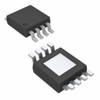
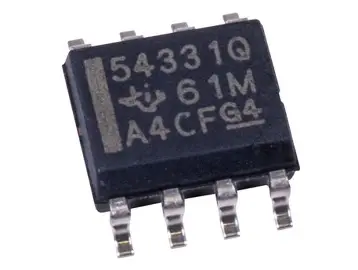
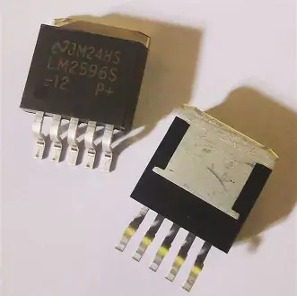
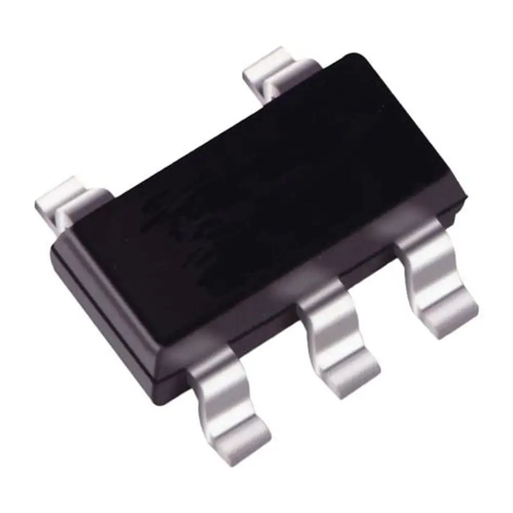
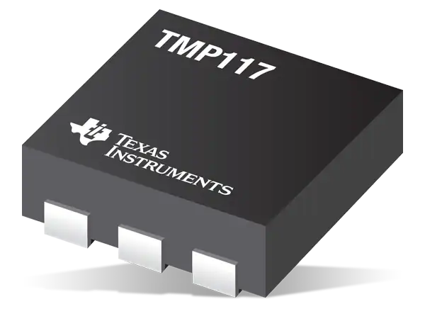
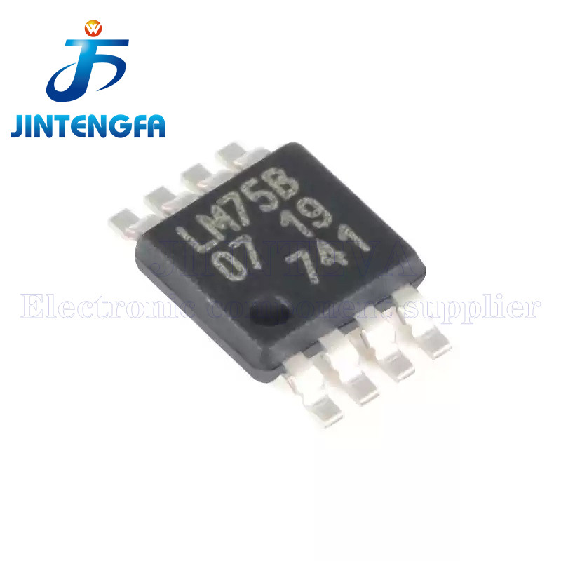
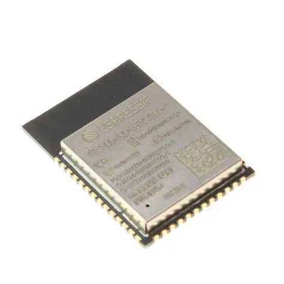
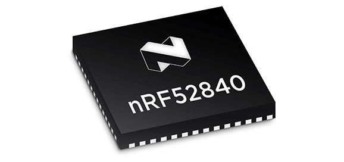

# Module Major Component Selection

The controller module performs temperature monitoring and wireless communication with a 12 V supply stepped down to 3.3 V. The ESP32-S3 module serves as the primary processor and communication device. Components were selected based on functional requirements, power constraints, ease of integration, and the overall system goals for reliability and simplicity.

## 1. Power Regulation (12 V to 3.3 V)

### Candidate A, MP2307DN-LF-Z, Selected

**Datasheet:**  
https://www.monolithicpower.com/en/documentview/productdocument/index/version/2/document_type/Datasheet/lang/EN/sku/MP2307/document_id/503/

| Pros | Cons |
|------|------|
| 3 A output capability | Requires external inductor |
| High efficiency | Layout sensitive |
| Compact SOIC 8 package | |

**Selection Rationale:**  
The MP2307DN-LF-Z was selected because it meets the requirement of converting a 12 V input into a stable 3.3 V rail while providing enough current headroom for the ESP32 and other digital loads. This margin is important because the ESP32 can draw short current spikes during wireless activity. Compared to the TPS54331, the MP2307 offers similar output capability in a compact package. Compared to the LM2596S, it provides a smaller footprint and better efficiency for this design. Although the MP2307 is more sensitive to layout and external component placement, it is still the best fit for the board because it balances size, performance, and current capacity.

### Candidate B, TPS54331

**Datasheet:**  
https://www.ti.com/lit/ds/symlink/tps54331.pdf

| Pros | Cons |
|------|------|
| TI reference designs and support | Larger footprint |
| 3 A output capability | Slightly higher cost |
| Stable regulator topology | |

**Evaluation:**  
The TPS54331 is a strong regulator option and would also be suitable for a 3.3 V rail. It was not selected because it takes up more board space than the MP2307 and does not provide a major enough advantage for this project. Since board size and layout efficiency matter, the smaller solution was preferred.

### Candidate C, LM2596S-3.3

**Datasheet:**  
https://www.ti.com/lit/ds/symlink/lm2596.pdf

| Pros | Cons |
|------|------|
| Very robust | Large package size |
| Easy to implement | Lower switching frequency |
| Inexpensive | Less compact |

**Evaluation:**  
The LM2596S is easy to use and is a common choice for simple power conversion. However, it is physically larger and less compact than the MP2307, which makes it less suitable for a smaller PCB. Because this project needed a cleaner and more space efficient layout, the LM2596S was not selected.

## 2. Temperature Sensor

### Candidate A, TC74A4-3.3VCTTR, Selected

**Datasheet:**  
https://ww1.microchip.com/downloads/en/DeviceDoc/21462D.pdf

| Pros | Cons |
|------|------|
| Small SOT 23 5 package | Moderate accuracy, about plus or minus 2 to 3 C |
| Works at 3.3 V | Simple, basic feature set |
| Simple 2 wire serial interface | Must be polled by host |

**Selection Rationale:**  
The TC74A4-3.3VCTTR was selected because it satisfies the system requirement for a low power temperature sensor that operates directly from 3.3 V and communicates easily with the ESP32. Its simple digital interface keeps the firmware and wiring straightforward. While its accuracy is not as high as more advanced sensors, the project did not require precision laboratory grade measurements. Compared to the TMP117, it is less expensive and simpler to integrate. Compared to the LM75B, it offers a compact package and an appropriate balance of size, cost, and functionality for this module.

### Candidate B, TMP117

**Datasheet:**  
https://www.ti.com/lit/ds/symlink/tmp117.pdf

| Pros | Cons |
|------|------|
| Very high accuracy | Higher cost |
| Advanced filtering and features | Smaller package |
| Low power | |

**Evaluation:**  
The TMP117 provides excellent accuracy and more advanced functionality than the other sensors. It was not selected because the extra precision was not necessary for this application. It would also increase component cost without adding enough value for the current requirements.

### Candidate C, LM75B

**Datasheet:**  
https://www.nxp.com/docs/en/data-sheet/LM75B.pdf

| Pros | Cons |
|------|------|
| Low cost | Lower precision |
| Widely supported I2C interface | Older part architecture |
| Simple to use | |

**Evaluation:**  
The LM75B was a reasonable low cost option, but the TC74 was a better match for the final design. The TC74 kept the same simplicity while fitting the design goals more cleanly.

## 3. Wireless Processing Module

### Candidate A, ESP32-S3-WROOM-1-N4, Selected

**Datasheet:**  
https://www.espressif.com/sites/default/files/documentation/esp32-s3-wroom-1_wroom-1u_datasheet_en.pdf

| Pros | Cons |
|------|------|
| Wi Fi and BLE | Higher power consumption |
| Native USB support | Requires careful antenna keep out |
| Large GPIO count | |

**Selection Rationale:**  
The ESP32-S3-WROOM-1-N4 was selected because it satisfies both processing and wireless communication requirements in a single module. This reduces the need for a separate microcontroller and simplifies the overall system architecture. The module also provides enough GPIO for future expansion and debugging features. Compared to the ESP32-WROOM-32, the ESP32-S3 offers native USB support, which is useful for programming and testing. Compared to the nRF52840, it includes Wi Fi capability, which is required for this application. Although it has somewhat higher power consumption than some alternatives, its feature set makes it the most suitable choice for the final design.

### Candidate B, ESP32-WROOM-32

**Datasheet:**  
https://www.espressif.com/sites/default/files/documentation/esp32-wroom-32_datasheet_en.pdf

| Pros | Cons |
|------|------|
| Mature ecosystem | Older BLE stack |
| Lower cost | No native USB |

**Evaluation:**  
The ESP32-WROOM-32 is a familiar and capable module, but it does not offer the same feature set as the ESP32-S3. Since native USB support and updated performance were desirable, the S3 was the better match.

### Candidate C, nRF52840 Module

**Datasheet:**  
https://infocenter.nordicsemi.com/pdf/nRF52840_PS_v1.9.pdf

| Pros | Cons |
|------|------|
| Excellent BLE performance | No Wi Fi |
| Very low power | Different toolchain |
| Integrated MCU | |

**Evaluation:**  
The nRF52840 is attractive for low power Bluetooth applications, but it does not include Wi Fi. Since wireless communication needs for this project included Wi Fi capability, it did not meet the full system requirement.

## Selected Components Summary

| Component Category | Selected Part | Selection Rationale |
|--------------------|---------------|---------------------|
| Power Regulator | **MP2307DN-LF-Z** | Efficient 12 V to 3.3 V conversion with sufficient current headroom for ESP32 wireless operation |
| Temperature Sensor | **TC74A4-3.3VCTTR** | Compact 3.3 V digital sensor with minimal firmware and BOM complexity |
| Wireless Processor | **ESP32-S3-WROOM-1-N4** | Integrated Wi Fi and BLE module that handles all processing and communication |

## Final Selection Summary

The final component set was chosen to keep the design compact, low power, and easy to integrate. The MP2307DN-LF-Z provides enough regulation margin for the controller subsystem. The TC74A4-3.3VCTTR keeps the temperature sensing circuit simple and efficient. The ESP32-S3-WROOM-1-N4 provides the main processing and communication capability in one device, which reduces board complexity and supports the overall system requirements.
