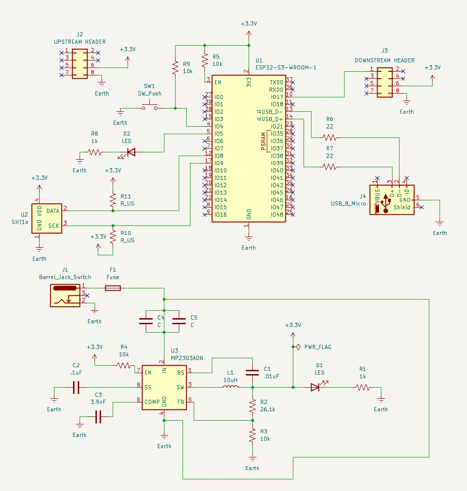

## Overview

This schematic represents the complete controller subsystem for the rover project.  
The design includes a 9–12V barrel jack input, a switching regulator (MP2307) that generates a regulated 3.3V rail, and an ESP32-S3-WROOM-1 microcontroller module.

The controller subsystem is responsible for:

- Regulating input power to 3.3V for all onboard components  
- Providing USB programming support via a Micro-USB connector  
- Transmitting control signals to the downstream rover module through the ribbon header  
- Reading environmental data from a temperature sensor  
- Supporting debugging through an onboard LED and pushbutton  

The 3.3V rail powers the ESP32, sensor, and communication interfaces.  
UART communication is transmitted to the downstream header.  
USB D+ and D− lines are routed through 22Ω series resistors for proper signal integrity.

---

**Figure 1:** Complete controller subsystem schematic including power regulation, ESP32 microcontroller, USB interface, ribbon headers, and sensor interface.

---

## Resources

The full schematic as a PDF download is available [*here*](ControllerSubsystem.pdf).

The complete KiCad project files (including schematic and footprints) are available as a Zip archive [*here*](ControllerSubsystemSchematic.zip).
