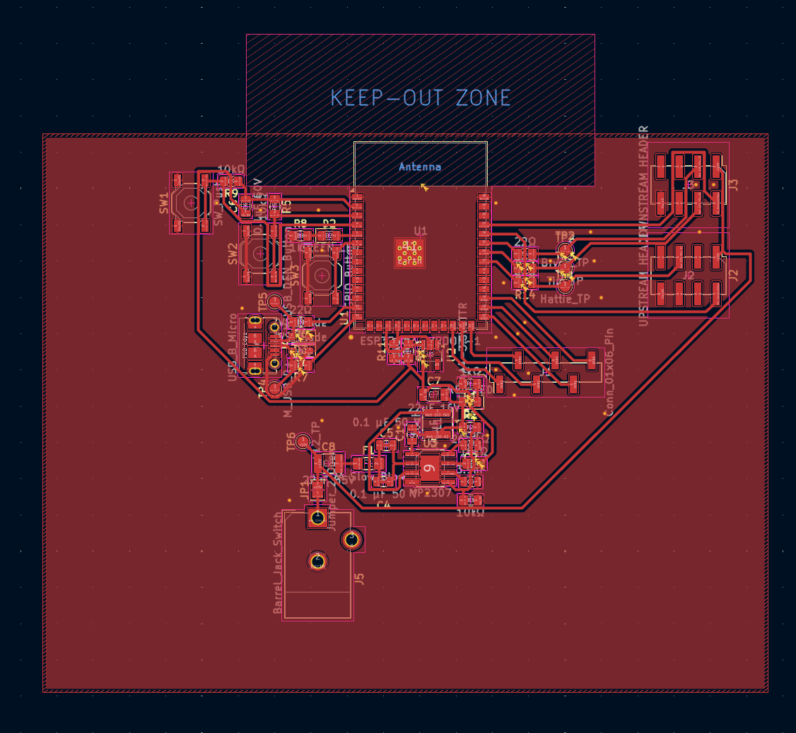
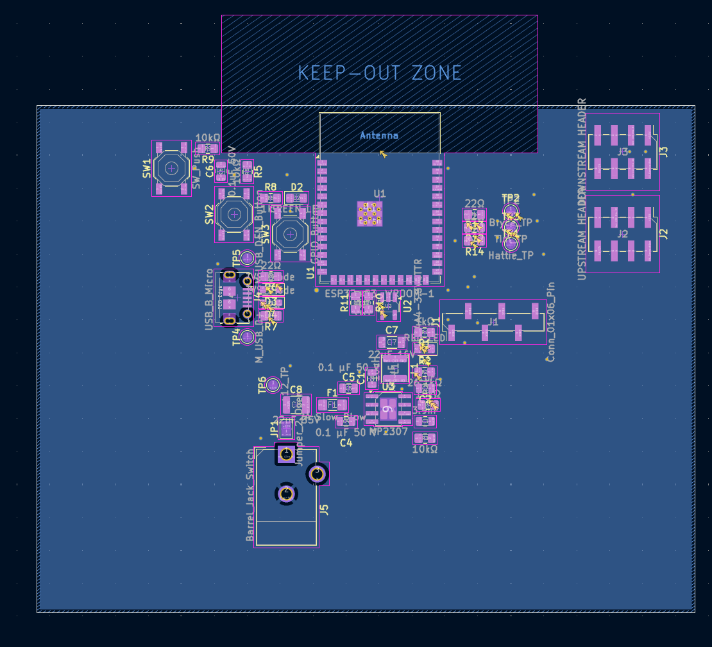
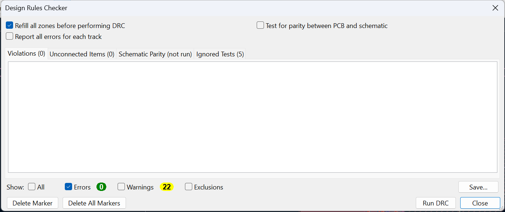

# Controller Subsystem PCB Layout

## Overview

This page documents the completed PCB layout for the Controller Subsystem.  
The design was developed in KiCad and updated from the finalized schematic.  
The board meets all Peralta PCB Mill manufacturing requirements and passes Design Rules Check (DRC) with zero errors.

The PCB integrates:

- ESP32-S3-WROOM-1 module  
- MP2307 buck regulator (12V to 3.3V conversion)  
- USB interface and ESD protection  
- Temperature sensor interface  
- Ribbon cable headers for subsystem communication  
- On-board user interface buttons and indicators  

---

## Board Specifications

- 2-layer PCB (F.Cu and B.Cu)  
- Ground plane on both layers  
- Maximum board size: within 100mm x 100mm requirement  
- Minimum signal trace width: 15 mil  
- Minimum power trace width: 40 mil  
- Minimum via drill: 0.5 mm  
- Copper removed beneath ESP32 antenna  
- No blind or buried vias  

Ground stitching vias were added to ensure proper electrical connection between top and bottom ground planes.

---

## PCB Layout Images

### Top Layer

### Bottom Layer

---

## Ground Plane Strategy

A continuous ground plane was implemented on both F.Cu and B.Cu layers.

- Zones assigned to Earth net  
- Thermal relief connections used for pads  
- Stitching vias added to eliminate isolated copper regions  
- Copper keep-out region implemented beneath ESP32 antenna  

This ensures proper return paths, EMI reduction, and stable switching regulator performance.

---

## Design Rules Verification

The final board passes Design Rules Check with zero errors.

---

## Fabrication Files

The following files were generated for manufacturing:

- Top Copper (.art)  
- Bottom Copper (.art)  
- Top Solder Mask (.art)  
- Bottom Solder Mask (.art)  
- Silkscreen (.art)  
- Board Outline (.art)  
- Drill File (.drl)  

All Gerber and drill files are packaged in:

**GerberFiles.zip**

The full KiCad project is included in:

**ControllerSubsystem.zip**

---

## Conclusion

The Controller Subsystem PCB layout is complete, manufacturable, and verified.

The design:

- Meets manufacturing constraints  
- Maintains proper power integrity  
- Ensures antenna performance  
- Passes DRC with zero errors  

This board is ready for fabrication and subsystem verification testing.

---

## Resources & Downloads

The following files are included for documentation and manufacturing:

- 📦 **Full KiCad Project Files:**  
  [ControllerSubsystem.zip](ControllerSubsystem.zip)

- 🛠 **Gerber and Drill Files for Fabrication:**  
  [GerberFiles.zip](GerberFiles.zip)
